---

### 🚀 About Me

- 🔭 Currently working on **Personal Portfolio Website**
- 🌱 Currently learning **JavaScript, React, Git & GitHub**
- 👯 Looking to collaborate on **[Open Source & Web Development Projects](https://github.com/Adi-who)**
- 🤝 Looking for help with **Advanced Web Development**
- 👨‍💻 All my projects are available at **[github.com/Adi-who](https://github.com/Adi-who)**
- 📝 I regularly write articles on **Coming Soon 🚀**
- 💬 Ask me about **HTML, CSS, JavaScript & Frontend Development**
- 📫 Reach me at **adityasinghhzb2005@gmail.com**
- 📄 My experience: **Coming Soon 🚀**
- ⚡ Fun fact: **I love turning ideas into websites 💻**

---

### 🏆 GitHub Trophies

---

### 📊 GitHub Analytics

> 💡 **Note:** Streaks and the activity graph need your GitHub contribution data to be public (Settings → Contributions & Activity) or these widgets may show as empty. If the activity graph occasionally fails to load, it's shared-server congestion on the free hosted instance — a page refresh usually fixes it, and there's currently no more reliable public alternative for that specific widget.

---

### 🌟 Featured Projects

 

> ✏️ Replace `repo-one`, `repo-two`, `repo-three` in `.github/workflows/stats.yml` with your actual repository names (both in the `repo=` option and the output filename), then re-run the workflow. These cards now render from files generated inside your own repo — see setup steps below.

---

### 🛠️ Languages & Tools

---

### 🤝 Connect with Me

⭐ If you like what you see, consider starring some of my repos!

